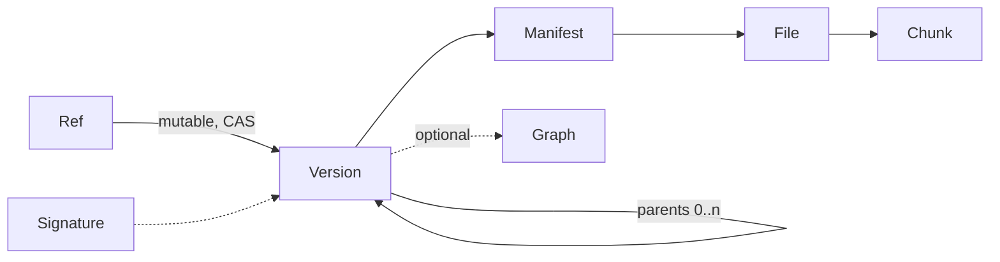

# Object model

**Date:** 2026-08-02
**Status:** Decided
**Phase:** 1 (build it and use it — no compatibility guarantee)

The project's first architectural refinement. Guiding principle from CLAUDE.md:
once chunk store, manifest and dependency graph are right, the wire protocol is
nearly a formality. Hence the object model first, the protocol later as a
distillation.

## Overview



Everything except **Ref** is immutable and content-addressed. Ref is the only
mutable structure in the entire system — not a side note, but the reason behind
a large share of the decisions below.

---

## 1. Framing

### E1 — Fibula is fully self-contained

**No dependency on Git, in any layer.** Neither mandatory nor optional, neither
technical nor conceptual. There is no Git mode, no manifest export to Git, no
special paths.

*Rationale:* an optional Git mode would have meant two version graphs to keep in
sync — divergence between them would not have been resolvable. The target
audience also includes artists for whom Git is an obstacle rather than a tool.

*Consequence:* Fibula is a Perforce replacement, not a Git companion. Version
graph, refs, checkout, history and working-copy management are our own work. The
increase in scope is bearable because binary assets have no merge — the hardest
part of a VCS (three-way merge, rebase) drops out entirely.

---

## 2. Object types & identity

### E2 — Two levels: a file object between chunk and manifest

- **Chunk** — raw bytes from the CDC, content-addressed
- **File** — list of chunk hashes, its own ID
- **Manifest** — path → FileID

*Rationale:* a flat manifest (path → chunk list) would repeat the full chunk
lists of all unchanged files in every version. For a project with 500 assets of
⌀ 200 MB at 2 MB chunks: ~50,000 chunk hashes versus 500 FileIDs, i.e. megabytes
versus ~75 KB per version.

*Side effects:* renaming or moving a file costs 0 bytes of transfer (only the
manifest changes). Dedup at file level becomes a single hash comparison instead
of chunk-by-chunk.

*Cost:* one level of indirection and one additional, batchable round trip during
sync.

### E3 — The FileID is the hash of the file content, not of the chunk list

*Rationale:* had identity been derived from the chunk list, it would depend on
the chunking parameters — any later change to min/avg/max or the mask would
change every FileID and retroactively destroy global dedup.

*Consequence:* the chunk list is an **attribute** of the file object, not its
identity. Two clients with different parameters produce the same FileID with
different chunk lists — resolvable (one list per FileID, first write wins). The
inverse case would not be resolvable.

*Most important effect:* the chunking parameters are therefore **not a format
constraint** but an efficiency question that can be decided later. BLAKE3 runs
over the whole stream anyway — the hash falls out of chunking for free.

### E4 — Domain separation via BLAKE3 `derive_key`

A distinct context string per object type (`fibula chunk v1`, `fibula file v1`,
…).

*Rationale:* without separation, a chunk and a file object with identical bytes
would get the same ID. For a small file that fits into exactly one chunk, that is
the normal case, not an edge case.

---

## 3. Manifest

### E5 — Flat, sorted text manifest — no Merkle tree

*Rationale:* the only real advantage of a directory tree would be partial
checkout of a subtree. For assets, however, meaningful subsets follow from the
dependency graph (E19 ff.), not from the directory structure. An additional
object type with traversal, consistency rules and several round trips is not
justified for that.

*Assessment of the alternative:* a Merkle tree saves ~30 KB versus ~64 KB (E6)
per change — half an order of magnitude with no practical effect, against
markedly higher complexity and a format no longer readable without tooling.

### E6 — The manifest is itself chunked

As an ordinary file object, but with a **smaller target size (~64 KB)** instead
of 1–4 MB.

*Rationale:* the manifest is content-addressed — one changed line changes the
whole object. On large projects (50,000 assets ≈ 7 MB manifest) with auto
snapshots every few minutes that would be hundreds of MB per day for manifests
alone. Because the file is sorted and line-based, a changed line hits exactly one
chunk.

*Effect:* 64 KB of transfer instead of 7 MB — effectively the Merkle benefit
without a new object type. Dedup and partial sync apply automatically, because
the manifest goes through the same machinery as any asset.

### E7 — Manifest contents: path, FileID, size

**Deliberately excluded:**

- **`mtime`** — would destroy determinism; two identical trees would yield
  different manifests. Belongs in the local status cache (E16).
- **Mode / executable bit** — assets are data, not code.
- **Asset type / MIME** — ties the format to a type table and is derivable from
  the extension.

The size is deliberate redundancy (it is also in the file object): it enables
progress display and plausibility checks without a store round trip. **On
divergence the content wins**, since the FileID is its hash — a mismatch is
corruption, not a case to reconcile.

### E8 — Path normalization

1. Separator **always `/`**, on Windows too
2. Relative to the manifest root — no leading `/`, no `./`, no `..`
3. **Unicode NFC** — macOS delivers NFD-decomposed names from APFS; without
   normalization the same file has different manifest entries on macOS and
   Windows
4. **Stored case-sensitively, collisions rejected** — `Textur.png` and
   `textur.png` in the same manifest are an error at *creation* time, not at
   restore time where Windows and macOS could not tell them apart
5. Sorting **bytewise over the UTF-8 bytes**, never locale-dependent
6. Tab and LF forbidden in paths (field separator, see E33)

### E9 — ManifestID; the manifest lives in the store

**ManifestID = BLAKE3 over the canonical serialization** (own `derive_key`
context).

The manifest is a store object like any other — required for the GC reference
check (the store must know which chunks are reachable) and for auto snapshots.

### E10 — Multiple manifests per project allowed

Usually exactly one, but the format must not preclude several
(`assets/characters.fibula`, `assets/environment.fibula`). Hence paths are
relative to the **manifest root** (E8.2), not to the project root.

---

## 4. Version graph

### E11 — Version object with a parent *list*

| Field | |
|---|---|
| ManifestID | the state |
| `parents []VersionID` | a list, not a single pointer |
| author, timestamp | |
| message | mandatory for deliberate versions |
| expiry | set only on auto snapshots |
| GraphID | optional (E21) |

**VersionID = BLAKE3 over the canonical serialization.**

*Rationale for the list:* the data model is format and expensive to change, the
tooling is not. A parent list costs nothing today and keeps branching/merging
open. Phase 1 produces linear history and fast-forward only.

*Why merge is deferred:* there is no three-way merge for a mesh. Every conflict
resolution on binary assets comes down to "one side wins" — that is a topic of
its own (locking, conflict copies) and remains open (see index.md).

### E12 — Snapshot and deliberate version are the same type

Distinguished by which fields are set:

- **Deliberate:** message mandatory, no expiry, reachable from a ref
- **Auto:** no message, expiry set, reachable only via the snapshot chain

*Rationale:* restore, diff and checkout thereby work identically for both, and
**promotion** becomes a natural workflow ("yesterday's 14:20 state was good, I'll
keep that one").

*Promotion creates a new object* referencing the same manifest; the snapshot
expires normally. No mutation of content-addressed objects, and it costs nothing
— the chunks are long since there.

The snapshot chain is a **timeline, not a content graph** — it stays linear even
when the working state changes completely in between.

### E13 — Refs: the only mutable structure

A named ref points at a VersionID (`main` as the default).

1. **CompareAndSwap is mandatory.** Without atomic updates, concurrent pushes
   lose versions — a silent data loss. A backend without CAS is not a valid
   RefStore.
2. **Refs belong in the index, not in the blob store.** They are mutable state;
   blob stores are built for immutability.
3. **Local and remote refs are separate.** Offline work happens on local refs and
   is reconciled during sync. A non-fast-forward is a conflict and therefore a
   user decision — never an automatic overwrite.

*Criticality:* refs are the **only** answer to "what is the current state". A
lost ref update is a lost working state, with no second system that still knows
it.

### E14 — Expiry via a thinning schedule

```
hourly  → last 24 hours
daily   → last 30 days
weekly  → last 6 months
```

*Rationale:* fits the purpose "safety net" better than a hard cutoff — yesterday
you want fine granularity, three months ago a weekly state suffices.

**Hard coupling to the data-loss invariant:** expiring a snapshot never deletes a
chunk referenced by a reachable deliberate version.

---

## 5. Space & working copy

### E15 — A space is the working copy

Not a separate concept: **a directory + its local state + a storage budget**.

"Clear space" therefore means precisely: delete asset files, keep metadata. The
space keeps its identity and history; restore is a pure download.

The budget is the trigger for space-triggered snapshots: limit reached → auto
snapshot → suggestion to clear. **Never delete automatically.**

### E16 — Contents of `.fibula/`

| | |
|---|---|
| Checked-out ref + VersionID | where we stand |
| Manifest of the checked-out version | target state |
| **Status cache** | per file: path, mtime, size, FileID, **chunk list** |
| Local snapshot chain | not yet synchronized |
| Configuration | store address, budget |

The stored **chunk list** replaces a local chunk cache: before a sync the client
knows what the store already has, without re-chunking. Cost: 32 bytes per chunk,
roughly 3 MB for 200 GB of assets. A real chunk cache would double the storage
requirement — unacceptable for binary assets.

### E17 — Dirty check: two levels of guarantee

The status cache is a heuristic (mtime lies across clock jumps, with tools that
preserve timestamps, on network shares with coarse resolution). The data-loss
invariant forbids heuristics before deletion. Resolution:

| | `status`, auto snapshot | `space clear` |
|---|---|---|
| Data source | status cache | **full re-hash**, cache ignored |
| Store existence | assumed | **positively confirmed** via batch query |
| When in doubt | continue | **abort** |

The check verifies **three** things:

1. Re-hash every local file → FileID
2. Every FileID must appear in a reachable version or snapshot
3. **Every referenced chunk must exist in the store** — not just locally

*Point 3 is the one people forget:* a locally created, never synchronized
snapshot sits entirely on the very disk about to be cleared. Without this check
"it is versioned" means nothing.

For **unversioned files** the operation does not abort but snapshots and pushes
them automatically, then deletes. Aborting with "there is something unversioned
here" is technically correct and in practice teaches users to reach for
`--force`.

*Price:* a full hash pass before every clear — one to two minutes for 200 GB with
BLAKE3. For an operation that deletes data, the right side of the trade.

### E18 — `.fibulaignore`, gitignore syntax

Needed because of `.blend1` backups, Substance temporaries, DCC autosaves. The
syntax is familiar to the target audience; there is no reason to invent
something new.

**Ignored files stay in place when clearing** and do not block it either — with a
notice ("12 GB of ignored files not deleted, `--include-ignored` to include
them"). Deleting them silently would be data loss on exactly those files that
were never in the store.

---

## 6. Dependency graph

### E19 — The graph is input, not derivation

**The core never parses asset formats.** Fibula defines an extractor interface
and stores what arrives; the extractors live outside the core.

- **Preferred: DCC integration** — the Blender plugin knows exactly which textures
  are linked at save time
- **Fallback: external extractors** per format, interchangeable
- **Escape hatch: manual declaration** via a sidecar file

*Rationale:* Git knows no programming languages. A core containing `.blend`
parsing breaks with every Blender release and is no longer a stable foundation.

### E20 — Edges are path-based

**Edge = (source path, target path, type)**, valid in the context of a manifest
version.

*Rationale:* when a texture is **replaced** in content (same path, new FileID),
nothing breaks — the level loads the new version. What actually breaks is a
**deleted or renamed path**; and the reference inside the DCC file *is* a path.
Were edges bound to FileIDs, every content change would invalidate all edges
although nothing about the relationship changed.

### E21 — Own object, optionally referenced by the manifest

The graph is content-addressed; the manifest optionally carries a GraphID.

*Rationale:* not inside the manifest itself, because that should stay small and
delta-friendly (E6) and edges change on a different rhythm than file listings.
Through the reference the graph still belongs to the version state — checking out
an old version yields the graph that was valid then.

### E22 — Advisory, never normative

The graph blocks no operation, it informs. An outdated extractor must not stop
anyone from working — otherwise the feature gets switched off and is dead.

Benefits: delete protection, broken-reference check, impact analysis and
**partial checkout** ("`level_01` and everything it needs") — the last of these
being the strongest in practice, and simultaneously the justification for not
having chosen a directory tree in E5.

### E23 — Extractor provenance belongs in the graph object

Recorded is **which extractors ran in which version over which files**.

*Rationale:* "no known edges" is not the same as "no dependencies". Without this
record, delete protection would turn into a false safety promise — "no references
found, so it is safe to delete" — and thus into precisely the data loss the
feature is meant to prevent. With it, the tool can say honestly: "no known
references, but no extractor runs for `.uasset` here."

---

## 7. Store interface

### E24 — Two interfaces, not one

```
ObjectStore   Get · Put · Exists            immutable, hash-addressed
RefStore      Get · CompareAndSwap · List   mutable, atomic
```

*Rationale:* every object except refs is immutable. Forcing both into one
interface ignores that they need different backends and different guarantees.

The **index deliberately does not appear as a third interface**: existence queries
are store operations; whether an implementation answers via Postgres or via
`stat()` is none of the caller's business.

### E25 — `Delete` does not belong in `ObjectStore`

Deletion lives in a separate `GCStore` that only the admin path receives.

*Rationale:* this anchors the data-loss invariant in the **type system** rather
than in discipline — a client holding an `ObjectStore` simply *cannot* delete.
The only place that may delete is thereby also the only place that has to
implement the reference check.

### E26 — `Get` returns verified bytes, not a stream

```
Get(ctx, id) ([]byte, error)   // verified, or error
```

*Rationale:* with an `io.ReadCloser` the hash check could only happen at the end
— by which point the caller has long since processed the data, and the error
check after the final `Read` is reliably forgotten. Because chunks are capped at
1–4 MB, every object fits in memory.

The streaming requirement lives one level up: a 4 GB file is a *sequence* of
chunks and very much is streamed. Memory cost at 16 parallel downloads: 64 MB.

### E27 — Verification as a decorator

The hash check belongs in a wrapper that every store passes through — not in
each implementation.

*Rationale:* otherwise the verification invariant is a convention that a new
backend overlooks while being written, and the mistake only surfaces months later
as a corrupted asset.

### E28 — Presigned URLs as an optional interface

```
URLSigner   SignedGetURL · SignedPutURL   // via type assertion
```

`fs.Store` has no URLs, S3 does. The transfer path checks for the capability: yes
→ direct transfer bypassing the server, no → stream through the server. The
difference is throughput, not correctness.

### E29 — Guarantees every implementation must uphold

| | |
|---|---|
| `Put` is **idempotent** | the same hash twice is not an error |
| `Put` is **atomic** | no half object ever becomes visible |
| `Exists` is **batch-only** | the signature does not offer single lookups at all |
| `CompareAndSwap` is **mandatory** | a backend without CAS is not a `RefStore` |

The batch signature is intentional: an `Exists(id)` in the interface would sooner
or later end up inside a loop — exactly the N+1 the coding standards forbid.

---

## 8. Authentication

Auth is largely a server question and stays open (see index.md). Two points touch
the format and are decided here.

### E30 — The server validates the author, it does not correct it

On push the server checks that the author matches the authenticated account; if
not, the version is **rejected**.

*Rationale:* versions are created offline and are content-addressed — correcting
one would change its ID. Rejecting works offline and keeps objects immutable.

### E31 — Signatures as their own object

`(VersionID, KeyID, signature)` — **not** as a field inside the version object.

*Rationale:* were the signature inside the version object, signing would have to
exclude its own field from the hash computation — the detour Git has to take. As
a separate object it is free of circularity, can be added later and allows
several signatures per version.

*Phase 1 does not build this*, the format merely leaves room.

### Trust boundary: presigned URLs

Anyone holding a presigned PUT URL can write **arbitrary bytes** under the object
key. **The store therefore always potentially contains objects whose content does
not match their hash.** E27 is consequently not a precaution against bit rot but
the only defence against a faulty or malicious client.

Supporting measures: short-lived URLs, exact object key, `Content-Length` limit,
per-account quota, asynchronous scrubber.

---

## 9. Serialization

### E32 — Text format throughout, no CBOR, no JSON

*Rationale:*

- **JSON** is notoriously hard to canonicalize (key order, Unicode escapes,
  number representation)
- **Canonical CBOR** is standardized, but implementations differ in the details.
  For a format whose foremost guarantee is byte equality, relying on a foreign
  library's canonicality is the wrong foundation.
- **Own text format:** our rules, trivially verifiable canonicality, readable
  with `cat` in phase 1

The objects are flat — no nesting, no floats, no type variants. That needs no
schema format. The price is a factor of 2 on hex hashes, which is negligible
against the assets.

### E33 — Framing and canonicality rules

Every object starts with `fibula-<type> v1`. The type designation is part of the
hashed content and thus a **second domain separation** alongside E4; it also
makes objects self-describing while debugging.

| Rule | |
|---|---|
| Encoding | UTF-8, **no BOM** |
| Line ending | **LF**, on Windows too |
| Line termination | every line ends with LF, including the last |
| Field separator | **tab** — tab and LF forbidden in paths (E8.6) |
| Whitespace | no trailing whitespace, no blank lines except in the message block |
| Numbers | decimal, no leading zeros |
| Timestamps | **RFC 3339, UTC, always `Z`, second resolution** |
| Optional fields | **omitted**, never written empty |
| Field order | fixed per object type |

### E34 — Hashes: hex, lowercase, no prefix

No `b3:` prefix. The format version on line 1 already determines the hash
algorithm — a future `v2` could mean a different one. A prefix on every hash
would be redundancy at a scale of millions.

### E35 — Chunk length in the file object

Each chunk line carries its length.

*Rationale:* costs about 8 bytes but allows seeking into a file without loading
all preceding chunks, as well as preallocating the target file — a real advantage
against fragmentation for multi-GB assets. Retrofitting would be a format break.

### Examples

**Manifest** — sorted by the UTF-8 bytes of the path:

```
fibula-manifest v1
assets/char/hero_diffuse.png	4f2a…9c1e	8388608
assets/char/hero_mesh.fbx	7b31…02af	24117248
```

**File** — order is meaningful, not sorted:

```
fibula-file v1
size	4294967296
4f2a…9c1e	2097152
8c04…11d3	1998848
```

**Version** — message as a multi-line block at the end:

```
fibula-version v1
manifest	a19f…4c2b
parent	3d8e…7701
author	dennis
time	2026-08-02T14:20:31Z
graph	c50a…88fe
message
Reworked hero rig, repacked UVs
```

**Graph** and **signature** follow the same pattern — the graph with one
`extractor` line per extractor that ran (E23), followed by the sorted `edge`
lines.

---

## Deliberately open

Not covered by this refinement, documented in [index.md](index.md): wire
protocol, concrete chunking parameters, conflict and locking strategy, extractor
interface, auth beyond tokens and project roles, shared cross-project chunk
cache.

## Consequences for CLAUDE.md

Already applied:

- Core model switched to self-containment (E1)
- License boundary client MIT / server AGPL with its layering rule
- The rule "the index is a cache over the store and must be reconstructible from
  it" now carries the refs exception (E13.2)
- "Chunking parameters are part of the format" replaced — per E3 they are an
  efficiency question, and the golden-vector rules distinguish accordingly
